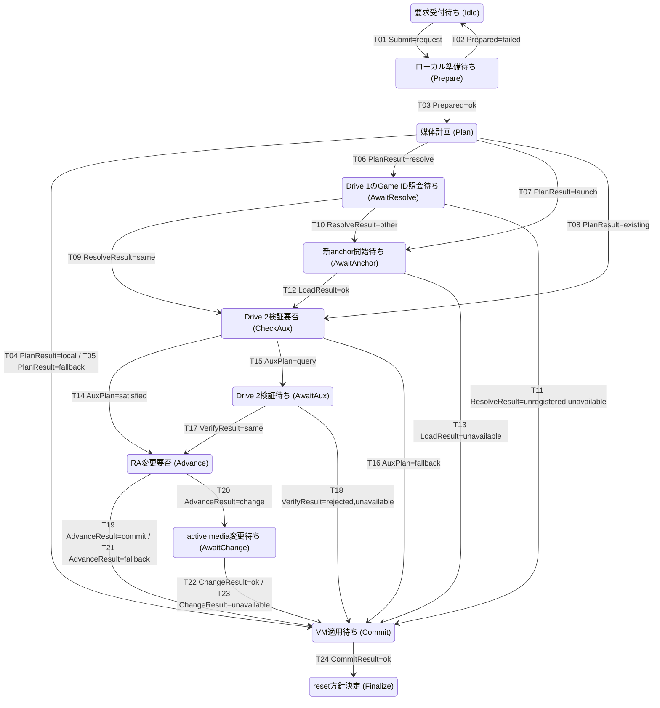
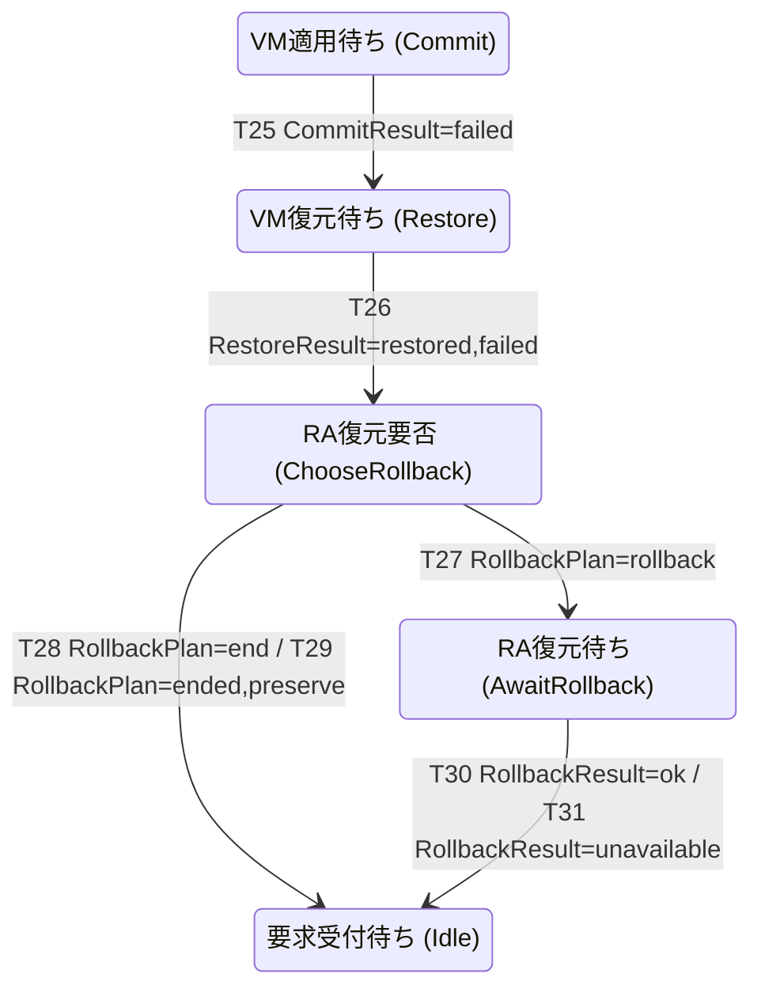
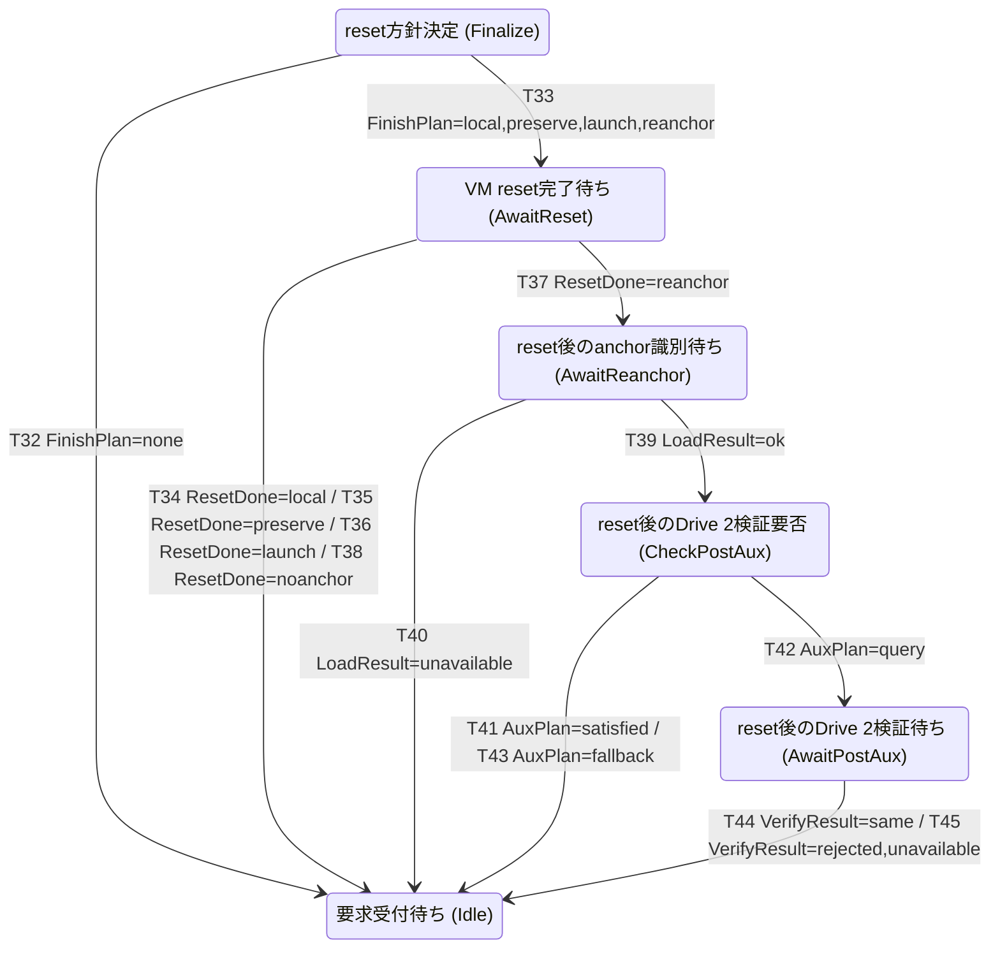

# RA媒体状態機械 遷移表・図（生成物）

**設計モデル。本番実装の検証結果ではない。手編集禁止。**

意味・適用範囲・判断関数は[48詳細設計](48_RA媒体状態機械詳細設計.md)を参照。
定義は[JSON](48_media_machine.json)、生成は[Python](48_generate_media_machine.py)。

## 1. 全二次元表

行はoperation、列はevent。Tは詳細遷移、BはBusy、Nは通信更新、Sは古い結果の破棄、Xは定義違反。
Submit前の受付判定と独立Ejectは48 §4.2に従う。Xを正常経路の網羅件数に含めない。

| operation | Submit | Prepared | PlanResult | ResolveResult | LoadResult | AuxPlan |
|---|---|---|---|---|---|---|
| Idle | T01 | X | X | X | X | X |
| Prepare | B | T02, T03 | X | X | X | X |
| Plan | B | X | T04, T05, T06, T07, T08 | X | X | X |
| AwaitResolve | B | X | X | T09, T10, T11 | X | X |
| AwaitAnchor | B | X | X | X | T12, T13 | X |
| CheckAux | B | X | X | X | X | T14, T15, T16 |
| AwaitAux | B | X | X | X | X | X |
| Advance | B | X | X | X | X | X |
| AwaitChange | B | X | X | X | X | X |
| Commit | B | X | X | X | X | X |
| Restore | B | X | X | X | X | X |
| ChooseRollback | B | X | X | X | X | X |
| AwaitRollback | B | X | X | X | X | X |
| Finalize | B | X | X | X | X | X |
| AwaitReset | B | X | X | X | X | X |
| AwaitReanchor | B | X | X | X | T39, T40 | X |
| CheckPostAux | B | X | X | X | X | T41, T42, T43 |
| AwaitPostAux | B | X | X | X | X | X |

| operation | VerifyResult | AdvanceResult | ChangeResult | CommitResult | RestoreResult | RollbackPlan |
|---|---|---|---|---|---|---|
| Idle | X | X | X | X | X | X |
| Prepare | X | X | X | X | X | X |
| Plan | X | X | X | X | X | X |
| AwaitResolve | X | X | X | X | X | X |
| AwaitAnchor | X | X | X | X | X | X |
| CheckAux | X | X | X | X | X | X |
| AwaitAux | T17, T18 | X | X | X | X | X |
| Advance | X | T19, T20, T21 | X | X | X | X |
| AwaitChange | X | X | T22, T23 | X | X | X |
| Commit | X | X | X | T24, T25 | X | X |
| Restore | X | X | X | X | T26 | X |
| ChooseRollback | X | X | X | X | X | T27, T28, T29 |
| AwaitRollback | X | X | X | X | X | X |
| Finalize | X | X | X | X | X | X |
| AwaitReset | X | X | X | X | X | X |
| AwaitReanchor | X | X | X | X | X | X |
| CheckPostAux | X | X | X | X | X | X |
| AwaitPostAux | T44, T45 | X | X | X | X | X |

| operation | RollbackResult | FinishPlan | ResetDone | Connectivity | Stale |
|---|---|---|---|---|---|
| Idle | X | X | X | N | S |
| Prepare | X | X | X | N | S |
| Plan | X | X | X | N | S |
| AwaitResolve | X | X | X | N | S |
| AwaitAnchor | X | X | X | N | S |
| CheckAux | X | X | X | N | S |
| AwaitAux | X | X | X | N | S |
| Advance | X | X | X | N | S |
| AwaitChange | X | X | X | N | S |
| Commit | X | X | X | N | S |
| Restore | X | X | X | N | S |
| ChooseRollback | X | X | X | N | S |
| AwaitRollback | T30, T31 | X | X | N | S |
| Finalize | X | T32, T33 | X | N | S |
| AwaitReset | X | X | T34, T35, T36, T37, T38 | N | S |
| AwaitReanchor | X | X | X | N | S |
| CheckPostAux | X | X | X | N | S |
| AwaitPostAux | X | X | X | N | S |

## 2. 状態とイベントの有限値

| 状態 | 意味 |
|---|---|
| Idle | 要求受付待ち |
| Prepare | ローカル準備待ち |
| Plan | 媒体計画 |
| AwaitResolve | Drive 1のGame ID照会待ち |
| AwaitAnchor | 新anchor開始待ち |
| CheckAux | Drive 2検証要否 |
| AwaitAux | Drive 2検証待ち |
| Advance | RA変更要否 |
| AwaitChange | active media変更待ち |
| Commit | VM適用待ち |
| Restore | VM復元待ち |
| ChooseRollback | RA復元要否 |
| AwaitRollback | RA復元待ち |
| Finalize | reset方針決定 |
| AwaitReset | VM reset完了待ち |
| AwaitReanchor | reset後のanchor識別待ち |
| CheckPostAux | reset後のDrive 2検証要否 |
| AwaitPostAux | reset後のDrive 2検証待ち |

| イベント | 分岐値（相互排他） |
|---|---|
| Submit | request |
| Prepared | ok, failed |
| PlanResult | local, fallback, resolve, launch, existing |
| ResolveResult | same, other, unregistered, unavailable |
| LoadResult | ok, unavailable |
| AuxPlan | satisfied, query, fallback |
| VerifyResult | same, rejected, unavailable |
| AdvanceResult | commit, change, fallback |
| ChangeResult | ok, unavailable |
| CommitResult | ok, failed |
| RestoreResult | restored, failed |
| RollbackPlan | rollback, end, ended, preserve |
| RollbackResult | ok, unavailable |
| FinishPlan | none, local, preserve, launch, reanchor |
| ResetDone | local, preserve, launch, reanchor, noanchor |
| Connectivity | connected, disconnected |
| Stale | retired |

rejectedは別Game ID／未登録、unavailableは開始不能・認証不能・照会不能等。
これらのRA結果をローカル準備失敗やVM適用失敗へ変換しない。

## 3. 詳細遷移

副作用は左から順に実行する。状態確定後に発行し、結果は別イベントとして処理する。

| ID | 現状態 | イベント / 分岐値 | 次状態 | 順序付き副作用 | 根拠 |
|---|---|---|---|---|---|
| T01 | Idle | Submit / request | Prepare | AcceptPrepare | 45 §1・§3.2 |
| T02 | Prepare | Prepared / failed | Idle | RejectLocal | 45 §1・§3.2 |
| T03 | Prepare | Prepared / ok | Plan | DecidePlan | 45 §3・§5 |
| T04 | Plan | PlanResult / local | Commit | ApplyVm | 45 §3、GU-01 |
| T05 | Plan | PlanResult / fallback | Commit | EnterOffline → ApplyVm | 45 §3・§5 |
| T06 | Plan | PlanResult / resolve | AwaitResolve | ResolveAnchor | 45 §3・§3.2 |
| T07 | Plan | PlanResult / launch | AwaitAnchor | BeginLaunch | 45 §3・§3.2 |
| T08 | Plan | PlanResult / existing | CheckAux | DecideAux | 45 §3・§3.2 |
| T09 | AwaitResolve | ResolveResult / same | CheckAux | RememberResolved → DecideAux | 45 §3.2 |
| T10 | AwaitResolve | ResolveResult / other | AwaitAnchor | RememberResolved → BeginLaunch | 45 §3 |
| T11 | AwaitResolve | ResolveResult / unregistered, unavailable | Commit | EnterOffline → ApplyVm | 45 §3・§5 |
| T12 | AwaitAnchor | LoadResult / ok | CheckAux | RememberLaunch → DecideAux | 45 §3.2 |
| T13 | AwaitAnchor | LoadResult / unavailable | Commit | EnterOffline → ApplyVm | 45 §3.2・§5 |
| T14 | CheckAux | AuxPlan / satisfied | Advance | DecideAdvance | 45 §3・§3.2 |
| T15 | CheckAux | AuxPlan / query | AwaitAux | VerifyAux | 45 §3・§3.2 |
| T16 | CheckAux | AuxPlan / fallback | Commit | EnterOffline → ApplyVm | 45 §3・§3.2 |
| T17 | AwaitAux | VerifyResult / same | Advance | RememberVerified → DecideAdvance | 45 §3.1・§3.2 |
| T18 | AwaitAux | VerifyResult / rejected, unavailable | Commit | EnterOffline → ApplyVm | 45 §3.2・§5 |
| T19 | Advance | AdvanceResult / commit | Commit | ApplyVm | 45 §3・§3.2 |
| T20 | Advance | AdvanceResult / change | AwaitChange | ChangeActive | 45 §3・§3.2 |
| T21 | Advance | AdvanceResult / fallback | Commit | EnterOffline → ApplyVm | 45 §3・§5 |
| T22 | AwaitChange | ChangeResult / ok | Commit | RememberChanged → ApplyVm | 45 §3・§3.2 |
| T23 | AwaitChange | ChangeResult / unavailable | Commit | EnterOffline → ApplyVm | 45 §1・§3・§5、48 §10 |
| T24 | Commit | CommitResult / ok | Finalize | DecideFinish | 45 §3.3 |
| T25 | Commit | CommitResult / failed | Restore | RememberCommitFailure → RestoreVm | 45 §3.2・§5 |
| T26 | Restore | RestoreResult / restored, failed | ChooseRollback | RememberRestore → DecideRollback | 45 §3.2・§5 |
| T27 | ChooseRollback | RollbackPlan / rollback | AwaitRollback | RollbackActive | 45 §3.2・§5 |
| T28 | ChooseRollback | RollbackPlan / end | Idle | EnterOffline → CompleteFailure | 45 §3.2、48 §6 |
| T29 | ChooseRollback | RollbackPlan / ended, preserve | Idle | CompleteFailure | 45 §3.2・§5 |
| T30 | AwaitRollback | RollbackResult / ok | Idle | RememberRolledBack → CompleteFailure | 45 §3.2・§5 |
| T31 | AwaitRollback | RollbackResult / unavailable | Idle | EnterOffline → CompleteFailure | 45 §3.2・§5 |
| T32 | Finalize | FinishPlan / none | Idle | CompleteSuccess | 45 §3.3・§5 |
| T33 | Finalize | FinishPlan / local, preserve, launch, reanchor | AwaitReset | ResetVm | 45 §3.3・§5、D&Dユーザー確認 |
| T34 | AwaitReset | ResetDone / local | Idle | CompleteSuccess | GU-01、D&Dユーザー確認 |
| T35 | AwaitReset | ResetDone / preserve | Idle | ResetProgress → CompleteSuccess | 45 §3.3 |
| T36 | AwaitReset | ResetDone / launch | Idle | ResetProgress → ActivateLaunch → CompleteSuccess | 45 §3.3 |
| T37 | AwaitReset | ResetDone / reanchor | AwaitReanchor | BeginReanchor | 45 §3.3・§5 |
| T38 | AwaitReset | ResetDone / noanchor | Idle | NoAnchor → CompleteSuccess | 48 §7・既存通常reset |
| T39 | AwaitReanchor | LoadResult / ok | CheckPostAux | RememberLaunch → DecidePostAux | 45 §3.2・§3.3、48 §7 |
| T40 | AwaitReanchor | LoadResult / unavailable | Idle | EnterOffline → CompleteSuccess | 45 §3.3・§5 |
| T41 | CheckPostAux | AuxPlan / satisfied | Idle | ResetProgress → ActivateLaunch → CompleteSuccess | 45 §3.2・§3.3 |
| T42 | CheckPostAux | AuxPlan / query | AwaitPostAux | VerifyAux | 45 §3.2・§3.3、48 §7 |
| T43 | CheckPostAux | AuxPlan / fallback | Idle | EnterOffline → CompleteSuccess | 45 §3.2・§3.3 |
| T44 | AwaitPostAux | VerifyResult / same | Idle | RememberVerified → ResetProgress → ActivateLaunch → CompleteSuccess | 45 §3.2・§3.3 |
| T45 | AwaitPostAux | VerifyResult / rejected, unavailable | Idle | EnterOffline → CompleteSuccess | 45 §3.2・§3.3 |

## 4. Mermaid図

全T遷移を三つの表示に分ける。同名状態は同一であり、別の状態機械ではない。
B/N/S/Xの共通セルは二次元表を参照。エッジはT番号・イベント・分岐値を示し、副作用は詳細遷移表へ対応する。

### 受付・準備・RA判定・VM適用

### VM失敗と復元

### reset・再識別・完了

## 5. 副作用の契約

| 副作用 | 契約 |
|---|---|
| AcceptPrepare | requestを所有し、対象snapshotを取得して全対象をローカル準備。Preparedを一回返す。RA OFFではRA処理なし。 |
| RejectLocal | 準備失敗で要求を終了。VM・RA sessionを変更せず失敗を一回通知。 |
| DecidePlan | 48 §5.1の純粋判定からPlanResultを返す。 |
| EnterOffline | 45に従いRA評価終了・cache破棄。媒体要求・reset用途・outboxを保持。RA OFF時はRA呼出し不要。 |
| ApplyVm | 48 §6に従い対象Driveを逐次適用し、必須保存も含むCommitResultを一回返す。 |
| ResolveAnchor | active mediaを変更しないhash照会。Same/Other/Unregistered/UnavailableをResolveResultで返す。 |
| BeginLaunch | 起動resetの必要性を記録。旧session終了、新世代Startingへ移り開始処理を実行。LoadResultを一回返す。 |
| RememberResolved | 照会で得たRA Game IDを記録。同Game IDの成功結果は現世代cache契約に従う。 |
| RememberLaunch | 識別結果をNewLaunchとして保持。Startingのまま、評価開始しない。 |
| DecideAux | 48 §5.2の対象Drive 2検証要否を判定してAuxPlanを返す。 |
| VerifyAux | 対象Drive 2 hashを当該Game IDに照会。VerifyResultを一回返す。 |
| RememberVerified | 対象hashの成功検証を現世代に束縛して記録。 |
| DecideAdvance | 48 §5.2に従いAdvanceResultを返す。 |
| ChangeActive | 現在照会可能な場合にDrive 1 media changeを開始。開始不能もChangeResult unavailableを返す。 |
| RememberChanged | 旧hashと新hashをChangedActiveとして保持。 |
| DecideFinish | 48 §7からResetDispositionを一度決め、FinishPlanを返す。 |
| RememberCommitFailure | 失敗したDrive、適用済みDrive、保存結果を保持。 |
| RestoreVm | 失敗Driveを含む変更対象をsnapshotへ戻し、RestoreResultを返す。 |
| RememberRestore | VM復元成否を保持。試みただけで成功としない。 |
| DecideRollback | 48 §6の排他的規則からRollbackPlanを返す。 |
| RollbackActive | 旧hashへRA rollback。開始不能もRollbackResult unavailableを返す。 |
| RememberRolledBack | 旧hashへの復元結果を記録。旧sessionが終了済みならこの経路を選ばない。 |
| CompleteFailure | 復元結果を伴う媒体失敗を一回通知して要求を解放。resetしない。 |
| CompleteSuccess | 媒体成功と現在RA状態・保存通知を一回通知し要求を解放。Offlineは媒体失敗ではない。 |
| ResetVm | ResetDispositionを保持してVM resetを一回実行。RTC・audio等の既存付随処理を保つ。ResetDoneを一回返す。 |
| ResetProgress | 保持したRA sessionの進捗を一回reset。VMを再resetしない。 |
| ActivateLaunch | NewLaunchのGame ID・hashを確定してActive系へ移る。現在の接続状態を反映。 |
| BeginReanchor | reset済みDrive 1で新世代Startingを開始。LoadResultを一回返す。VM resetしない。 |
| NoAnchor | 通常reset後、Drive 1未挿入の非評価状態Readyへ整理。空hashを識別しない。 |
| DecidePostAux | 同じ二Drive要求に含まれたDrive 2 Mountについて新Game IDでAuxPlanを返す。単独要求のKeepは対象化しない。 |
| UpdateConnectivity | 45 §4に従い接続snapshotとActive系sessionを更新。operationを変更しない。 |
| RejectBusy | 競合する別要求にBusy。所有中要求・Drive構成を保持。 |
| IgnoreStale | 終了済みeffectの遅延・重複結果を副作用なしで破棄。 |
| ProtocolError | 定義違反を検出。テスト失敗。正規入力の拒否／fallbackとして流用しない。 |

| 結果を生成する副作用 | 配送するイベント |
|---|---|
| AcceptPrepare | Prepared |
| DecidePlan | PlanResult |
| ApplyVm | CommitResult |
| ResolveAnchor | ResolveResult |
| BeginLaunch | LoadResult |
| DecideAux | AuxPlan |
| VerifyAux | VerifyResult |
| DecideAdvance | AdvanceResult |
| ChangeActive | ChangeResult |
| DecideFinish | FinishPlan |
| RestoreVm | RestoreResult |
| DecideRollback | RollbackPlan |
| RollbackActive | RollbackResult |
| ResetVm | ResetDone |
| BeginReanchor | LoadResult |
| DecidePostAux | AuxPlan |

## 6. 抽象経路の検証例

イベント列の接続と列挙したeffect回数を検証する。入力変換・判断の正しさ・実Drive結果は本番試験で確認する。

### P01 RA OFFの単独／両Drive通常操作の経路（入力変換は本番試験）

T01(request) → T03(ok) → T04(local) → T24(ok) → T32(none)

観測: ApplyVm=1, ResetVm=0, EnterOffline=0, CompleteSuccess=1

### P02 RA OFFのD&D：commit後にreset一回

T01(request) → T03(ok) → T04(local) → T24(ok) → T33(local) → T34(local)

観測: ApplyVm=1, ResetVm=1, BeginLaunch=0, CompleteSuccess=1

### P03 ローカル準備失敗：RA・VM変更前に終了

T01(request) → T02(failed)

観測: ApplyVm=0, EnterOffline=0, RejectLocal=1

### P04 Drive 2の現session検証済み媒体：通信なし

T01(request) → T03(ok) → T08(existing) → T14(satisfied) → T19(commit) → T24(ok) → T32(none)

観測: VerifyAux=0, ChangeActive=0, ApplyVm=1

### P05 同一ゲーム二Drive交換：D2検証→D1変更

T01(request) → T03(ok) → T06(resolve) → T09(same) → T15(query) → T17(same) → T20(change) → T22(ok) → T24(ok) → T32(none)

観測: VerifyAux=1, ChangeActive=1, ApplyVm=1, ResetVm=0

### P06 新anchor二Drive起動：識別→D2検証→commit→reset

T01(request) → T03(ok) → T07(launch) → T12(ok) → T15(query) → T17(same) → T19(commit) → T24(ok) → T33(launch) → T36(launch)

観測: BeginLaunch=1, VerifyAux=1, ApplyVm=1, ResetVm=1, ActivateLaunch=1

### P07 識別不能でも二Driveをmount、reset後も識別不能なら完了

T01(request) → T03(ok) → T07(launch) → T13(unavailable) → T24(ok) → T33(reanchor) → T37(reanchor) → T40(unavailable)

観測: ApplyVm=1, ResetVm=1, BeginReanchor=1, CompleteSuccess=1

### P08 D2不適合→Offline commit→reset→再識別後のD2も不適合

T01(request) → T03(ok) → T08(existing) → T15(query) → T18(rejected) → T24(ok) → T33(reanchor) → T37(reanchor) → T39(ok) → T42(query) → T45(rejected)

観測: ApplyVm=1, ResetVm=1, BeginReanchor=1, ActivateLaunch=0, CompleteSuccess=1

### P09 Offlineで新D1をmount→通常reset→登録ゲームとして開始

T01(request) → T03(ok) → T04(local) → T24(ok) → T33(reanchor) → T37(reanchor) → T39(ok) → T41(satisfied)

観測: ApplyVm=1, ResetVm=1, BeginReanchor=1, ActivateLaunch=1

### P10 通信断でD1交換：Offline mount、reset追加なし

T01(request) → T03(ok) → T05(fallback) → T24(ok) → T32(none)

観測: EnterOffline=1, ApplyVm=1, ResetVm=0

### P11 D1変更後VM失敗：VM復元→RA復元

T01(request) → T03(ok) → T08(existing) → T14(satisfied) → T20(change) → T22(ok) → T25(failed) → T26(restored) → T27(rollback) → T30(ok)

観測: RestoreVm=1, RollbackActive=1, ResetVm=0, CompleteFailure=1

### P12 RA復元不能：Offlineで媒体失敗通知

T01(request) → T03(ok) → T08(existing) → T14(satisfied) → T20(change) → T22(ok) → T25(failed) → T26(restored) → T27(rollback) → T31(unavailable)

観測: EnterOffline=1, RestoreVm=1, CompleteFailure=1

### P13 Offline fallback後VM失敗：旧sessionを復帰しない

T01(request) → T03(ok) → T05(fallback) → T25(failed) → T26(restored) → T29(ended)

観測: EnterOffline=1, RollbackActive=0, ResetVm=0, CompleteFailure=1

### P14 既存sessionを維持するD&D：reset一回

T01(request) → T03(ok) → T08(existing) → T14(satisfied) → T19(commit) → T24(ok) → T33(preserve) → T35(preserve)

観測: ResetVm=1, ResetProgress=1, BeginReanchor=0, CompleteSuccess=1

### P15 未知D1が別Game ID：新anchor開始へ

T01(request) → T03(ok) → T06(resolve) → T10(other) → T12(ok) → T14(satisfied) → T19(commit) → T24(ok) → T33(launch) → T36(launch)

観測: ResolveAnchor=1, BeginLaunch=1, ChangeActive=0, ResetVm=1

### P16 VM構成を復元できない場合は成功と報告しない

T01(request) → T03(ok) → T08(existing) → T14(satisfied) → T19(commit) → T25(failed) → T26(failed) → T28(end)

観測: RestoreVm=1, EnterOffline=1, CompleteFailure=1

### P17 未検証Drive 2を照会できない場合もmountする

T01(request) → T03(ok) → T08(existing) → T16(fallback) → T24(ok) → T32(none)

観測: EnterOffline=1, ApplyVm=1, VerifyAux=0

### P18 media change開始不能もOffline mount

T01(request) → T03(ok) → T08(existing) → T14(satisfied) → T20(change) → T23(unavailable) → T24(ok) → T32(none)

観測: EnterOffline=1, ApplyVm=1, CompleteSuccess=1

### P19 Drive 1 hash未登録でもmountする

T01(request) → T03(ok) → T06(resolve) → T11(unregistered) → T24(ok) → T32(none)

観測: EnterOffline=1, ApplyVm=1, BeginLaunch=0

### P20 Drive 2検証後に通信不能ならD1変更を発行せずfallback

T01(request) → T03(ok) → T08(existing) → T15(query) → T17(same) → T21(fallback) → T24(ok) → T32(none)

観測: ChangeActive=0, EnterOffline=1, ApplyVm=1

### P21 reset後の二Drive検証成功で評価開始

T01(request) → T03(ok) → T04(local) → T24(ok) → T33(reanchor) → T37(reanchor) → T39(ok) → T42(query) → T44(same)

観測: ResetVm=1, BeginReanchor=1, VerifyAux=1, ActivateLaunch=1

### P22 reset後のDrive 2照会不能は再resetしない

T01(request) → T03(ok) → T04(local) → T24(ok) → T33(reanchor) → T37(reanchor) → T39(ok) → T43(fallback)

観測: ResetVm=1, EnterOffline=1, ActivateLaunch=0, CompleteSuccess=1

### P23 通常reset後にDrive 1未挿入なら識別しない

T01(request) → T03(ok) → T04(local) → T24(ok) → T33(reanchor) → T38(noanchor)

観測: ResetVm=1, BeginReanchor=0, NoAnchor=1

### P24 新anchor起動後のVM失敗は旧sessionを復活させない

T01(request) → T03(ok) → T07(launch) → T12(ok) → T14(satisfied) → T19(commit) → T25(failed) → T26(restored) → T28(end)

観測: BeginLaunch=1, RestoreVm=1, EnterOffline=1, CompleteFailure=1

## 7. 機械検証の集計

- 状態: 18、イベント: 17、全セル: 306
- 通常セル: 18、T遷移: 45
- B: 17、N: 18、S: 18、X: 235
- 抽象経路: 24

有限分岐の全値が一意に遷移することと、各状態からIdleへの経路の存在を検証する。
これは外部応答の到着や本番の全状態到達性の証明ではない。
